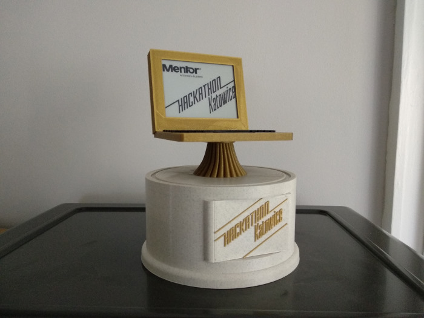

# EBSHackathon
Hackathon trophy model and firmware for Mentor Graphics Katowice hackathon event. Trophy is highly hackable!

## 3D model and 3D print
Trophy was designed in Autodesk Fusion 360. Step and stl models are located in the **Model** directory.

Front plate (where gold Hackathon Katowice label is shown) is detachable, so you may design new one and replace it. Notebook is glued to the foot and foot is connected to the base by three M3 screws. Notebook backplate is detachable, but currently is hot-glued to the display.
At the bottom of the base, there is circular cover fixed by three M3 screws. There is USB powerbank and ESP8266 inside. Power bank can be charged by external USB-A socket (power only - data signals are unconnected).

## Electronics
ESP8266 board is used - [Lolin D1 R2](https://botland.com.pl/pl/moduly-wifi/8241-modul-wifi-esp8266-nodemcu-v3.html) together with [Waveshare 4.2'' e-paper](https://botland.com.pl/pl/wyswietlacze-e-paper/9655-waveshare-e-paper-e-ink-42-400x300px-modul-z-wyswietlaczem-spi.html). Due to the deep-sleep functionality, D0 output is connected to the reset pin. There are two unconnected wires between base and monitor - can be used to e.g. power lights or connect some sensor.

## Firmware
Firmware is written in Arduino with ESP8266 support and GxEPD2 graphics library installed. These are only two packages needed to be installed to compile the firmware. WiFi is not used. ESP8266 is flexible, so you may install and use anything you need to hack the trophy.
To add new picture, prepare 400x300 black and white pixmap and convert it to C array using attached [BitmapConverter](https://github.com/briandorey/BitmapToByteArrayConverter). Example pixmaps are located in Firmware/images, converted arrays are located in Firmware/pic.h header.
